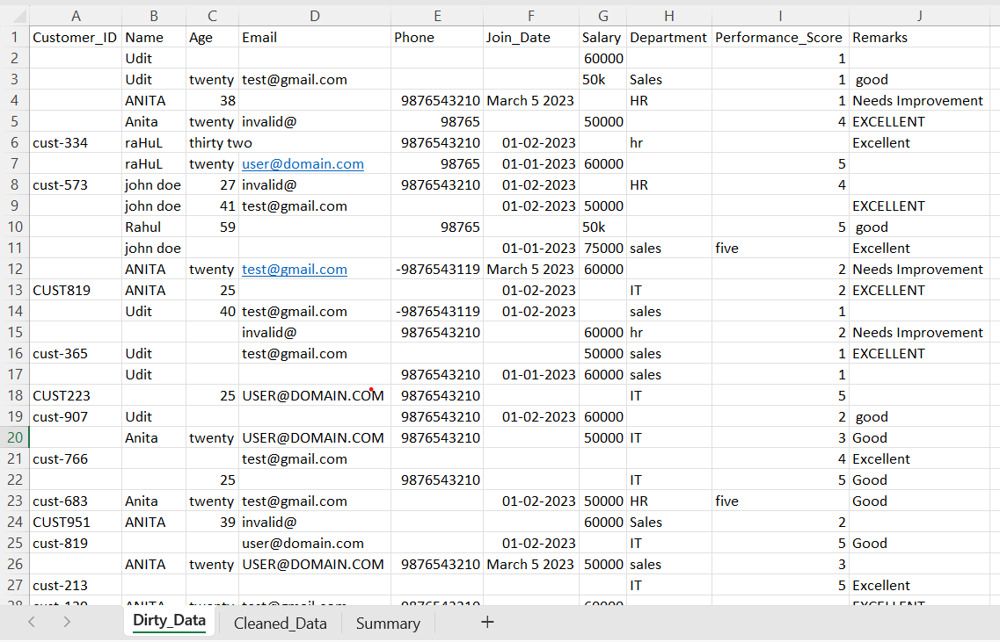
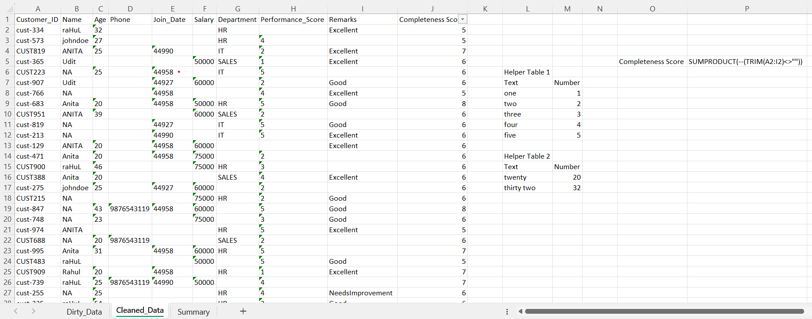
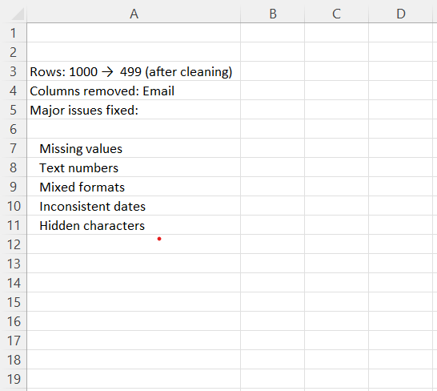

# 📊 Data Cleaning Project (Excel)

## 🧠 Overview
This project focuses on cleaning and transforming a highly messy dataset into a structured and analysis-ready format using Microsoft Excel.

The raw dataset contained multiple real-world data issues such as missing values, inconsistent formats, and invalid entries.

---

## 📂 Dataset
- Rows: ~1000
- Columns: 10
- Sheets:
  - Dirty_Data
  - Cleaned_Data
  - Summary

---

## ⚠️ Problems Identified

- Missing values and blank cells
- Text-based numbers in Age column (e.g., "twenty", "thirty two")
- Mixed salary formats (e.g., "50k", "60000")
- Inconsistent date formats (text, numeric, blanks)
- Duplicate and inconsistent categorical values
- Invalid email data (removed column)
- Hidden characters causing incorrect counts

---

## 🛠️ Data Cleaning Steps

### 1. Handling Missing Values
- Removed rows with critical missing identifiers
- Imputed or left non-critical blanks appropriately

### 2. Age Column Cleaning
- Converted text values to numeric using mapping approach
- Standardized all values to numeric format

### 3. Date Standardization
- Converted mixed date formats into consistent Excel date format

### 4. Salary Cleaning
- Transformed values like "50k" into numeric format (50000)
- Ensured consistency across the column

### 5. Email Column
- Removed due to non-usable and repetitive dummy data

### 6. Data Standardization
- Cleaned text (TRIM, LOWER)
- Fixed inconsistent categories (HR, hr, SALES, etc.)

### 7. Data Quality Check
- Created a completeness score using:
  SUMPRODUCT(--(TRIM(range)<>""))
- Sorted data based on completeness

---

## 📈 Key Learnings

- Real-world data is often messy and inconsistent
- Hidden characters can affect analysis
- Data cleaning requires both technical and business understanding
- Excel can handle complex cleaning tasks efficiently

---

## 🚀 Tools Used

- Microsoft Excel
- Functions: VLOOKUP, IFERROR, TRIM, VALUE, SUMPRODUCT
- Techniques: Data validation, sorting, filtering, transformation

---

## 💼 Outcome

The dataset was successfully transformed into a clean, structured format ready for analysis and reporting.

## 📸 Images

---

## 🔗 Connect with Me

LinkedIn: https://www.linkedin.com/in/udit-narayan-jena04/